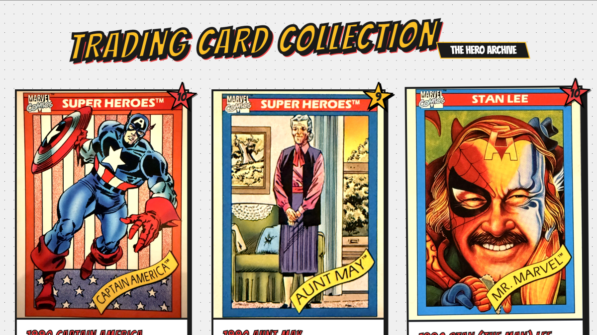

# Headless WordPress + SvelteKit Workshop Project for the Edmonton WordPress Meetup



This is a fork of [Clem Omotosho’s headless WordPress workshop repo](https://github.com/clementm8/Headless-WordPress-SvelteKit-Site), adapted as a **hands-on tutorial project for the [Edmonton WordPress Meetup](https://wpyeg.org/)**.

You can see a working front-end demo of Clem's current version here: [https://headless-wordpress-sveltekit-site.vercel.app/](https://headless-wordpress-sveltekit-site.vercel.app/)

The upstream repo and this fork are intended for:
- YEG meetup attendees following along with the workshop series
- students learning modern WordPress development
- developers curious about **headless / decoupled WordPress** with **SvelteKit**, **WPGraphQL**, and a local WordPress install

## Getting started

[Clem's tutorial](https://amazing-questions-440483.framer.app/) provides the 5-step workshop path to create your own working version of the original demo site. Work through that flow first in your local development environment. Then use this fork to study one path for extending the project safely and incrementally.

## Architecture summary

This fork demonstrates a headless architecture in which WordPress stays read-only and SvelteKit owns the interactive rating feature. Content lives in WordPress and is rendered through SvelteKit using WPGraphQL.

- **WordPress**: read-only content source for cards
- **SvelteKit**: server-rendered app, rating API, CSRF/session enforcement
- **SQLite**: local rating, vote, and rate-limit storage at `.data/ratings.sqlite`

## What this fork adds beyond the original workshop repo

This fork goes beyond the initial workshop scaffold with:
- server-rendered card detail pages
- interactive star ratings stored in the SvelteKit app, not in WordPress
- accessibility improvements and documentation
- SEO foundations:
  - canonical card pages
  - metadata + JSON-LD
  - `robots.txt`
  - `sitemap.xml`
- improved image loading and caching for the card grid
- a safer architecture that keeps WordPress read-only

See also:
- [docs/decisions/ratings-storage.md](docs/decisions/ratings-storage.md)
- [docs/seo/roadmap.md](docs/seo/roadmap.md)
- [docs/accessibility/accessibility-changes.md](docs/accessibility/accessibility-changes.md)
- [docs/accessibility/manual-qa-checklist.md](docs/accessibility/manual-qa-checklist.md)

## Why ratings live in SvelteKit instead of WordPress

We explicitly chose to keep rating writes out of WordPress so we do not need an mu-plugin or another public WordPress write surface.

**Benefits:**
- keeps WordPress read-only for this demo
- avoids exposing anonymous WPGraphQL or REST mutations
- lets us enforce CSRF, signed sessions, and rate limiting in one place
- keeps the rating interaction fast for a simple local or low-traffic deployment

**Tradeoffs:**
- ratings are local to the SvelteKit app instance
- SQLite is best for one persistent server, not multi-instance/serverless hosting
- if this later needs shared infrastructure or analytics-heavy querying, Postgres becomes the better fit

See [docs/decisions/ratings-storage.md](docs/decisions/ratings-storage.md) for the full decision record.

## Recommended learning path

If you are coming from the meetup or starting fresh, this is a good path:

1. **[Read the meetup recap](https://wpyeg.org/2026/02/26/what-is-headless-wordpress-jan-feb-workshop-recap-whats-next-at-the-yeg-wp-meetup/)** to understand what “headless” means in practical WordPress terms.
2. **[Work through Clem’s tutorial](https://amazing-questions-440483.framer.app/)** to understand the original workshop flow.
3. **Use this fork** to study how the project can be extended safely and incrementally.
4. **Create your own fork** if you want to experiment and share improvements.

## Configuration

Copy `.env.example` to `.env` and adjust values as needed.

- `WP_GRAPHQL_URL`: WordPress GraphQL endpoint used by the SvelteKit server
- `PUBLIC_SITE_URL`: canonical public site URL used for metadata, sitemap, and robots output
- `SESSION_SECRET`: secret used to sign the session cookie in production
- `RATING_RATE_LIMIT_MAX_ATTEMPTS`: max rating actions allowed per window
- `RATING_RATE_LIMIT_WINDOW_MS`: rate-limit window in milliseconds

A common local default is `http://127.0.0.1:8882/graphql/`. If your WordPress site runs on a different host or port, update `.env`.
In development, the default rating limit is 50 actions per minute so local demos do not get throttled too aggressively.

## Local setup

### 1. Set up your WordPress site

Follow Clem’s tutorial and the meetup notes to create a local WordPress site and enable:
- WordPress
- WPGraphQL
- the workshop content/cards

The tutorial materials include the trading-card content export data used for the workshop. Import that into WordPress so your local site has the sample card content.

### 2. Confirm your GraphQL endpoint

You should be able to reach a local GraphQL endpoint such as:

```txt
http://127.0.0.1:8882/graphql/
```

### 3. Install dependencies

```bash
npm install
```

### 4. Create your local environment file

Copy `.env.example` to `.env` and update as needed.

Example:

```env
WP_GRAPHQL_URL=http://127.0.0.1:8882/graphql/
PUBLIC_SITE_URL=http://localhost:5173
SESSION_SECRET=change-me-in-production
RATING_RATE_LIMIT_MAX_ATTEMPTS=50
RATING_RATE_LIMIT_WINDOW_MS=60000
```

### 5. Run the app

```bash
npm run check
npm test
npm run dev
```

Then open:

```txt
http://localhost:5173
```

## Useful commands

Check the project:

```bash
npm run check
```

Run tests:

```bash
npm test
```

Build the project:

```bash
npm run build
```

Reset the local ratings database:

```bash
npm run ratings:reset
```

## What to explore in the codebase

If you are learning from this repo, these are good entry points:

### WordPress data access
- `/src/lib/server/wp.ts`

### SEO helpers
- `/src/lib/server/seo.ts`

### Ratings architecture
- `/src/lib/server/ratings.ts`
- `/src/routes/api/rating/+server.ts`

### Card UI
- `/src/components/Card.svelte`
- `/src/components/CardRow.svelte`

### Card detail pages
- `/src/routes/cards/[slug]/+page.server.ts`
- `/src/routes/cards/[slug]/+page.svelte`

## Good workshop discussion questions

- When is headless WordPress actually worth the complexity?
- When should WordPress remain monolithic instead?
- What belongs in WordPress vs. the front end?
- How do SEO, accessibility, and performance responsibilities change in a decoupled setup?
- When is a feature or architectural choice like the local SQLite rating store “good enough,” and when should it move to shared infrastructure with the CMS?

## Contributing

This fork welcomes contributions from:
- meetup attendees
- students
- WordPress developers learning headless architecture
- front-end developers curious about WordPress as a content platform

Please see [CONTRIBUTING.md](CONTRIBUTING.md).

## Upstream credit

Original workshop/tutorial concept and repo inspiration:
- [Clem Omotosho](https://github.com/clementm8/)

Meetup context and write-up:
- [Edmonton WordPress Meetup / WP YEG](https://wpyeg.org) blog: ["What is headless WordPress?"](https://wpyeg.org/2026/02/26/what-is-headless-wordpress-jan-feb-workshop-recap-whats-next-at-the-yeg-wp-meetup/)

## Fork note

This is a fork-oriented README intended for visitors to **Dan Knauss’s fork**.
It is intentionally more tutorial- and meetup-facing than the upstream project documentation.
